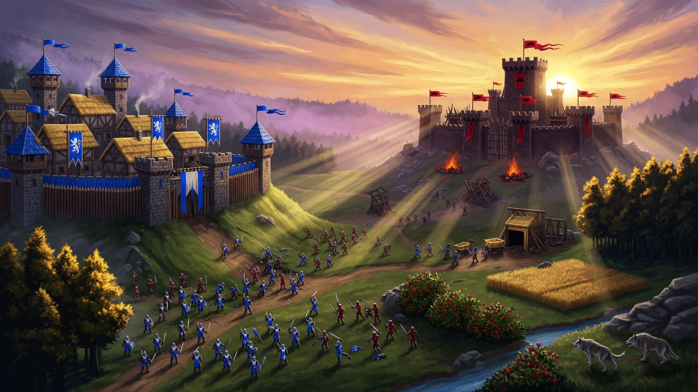

# Empires of the Dawn — Mini Age of Empires RTS

> **Вариант A (стабильный, релизный)** — полностью процедурная изометрия без внешних тайлов, без пробелов между плитками, 60 FPS на десктопе и мобилках.
> Вариант B (экспериментальный с ассетами scrabling) — отложен из-за проблем с паком спрайтов и gaps между тайлами.

[](#)
[](#)
[](#)
[](#)
[](#)

Крошечная, но сочная RTS в духе Age of Empires 2, которая запускается в браузере за секунды. Собирай ресурсы, строй базу, качай эпохи, отбивай волны рейдов и разнеси вражеский Town Center.

**Live Demo:** после деплоя на GitHub Pages будет доступен по `https://<username>.github.io/empires-of-the-dawn/`



---

## ✨ Что внутри (Вариант A)

### Геймплей
- 3 ресурса: 🪵 дерево / 🍖 еда / 🪙 золото
- 4 юнита: Villager, Militia, Archer, Knight + волки (нейтралы)
- 5 зданий: Town Center, House (+8 pop), Barracks, Watch Tower, Farm (бесконечная еда)
- 4 эпохи: Dark → Feudal → Castle → Imperial (баффы к HP/урону)
- Вражеский AI: копит ресурсы, строит дома/казармы/башни, качает эпохи, шлет волны (horn + баннер)
- Квесты-туториал: наруби 60 дерева, нанимай армию, построй казарму, убей волков, выйди в Feudal
- Победа/поражение по уничтожению Town Center

### Фишки / Juice
- Тряска экрана (trauma), частицы (щепки, искры, дым, огонь), урон-цифры, кольца выделения
- Процедурная изометрия 2:1: `toIso(wx,wy) = (wx-wy, (wx+wy)/2)`, шаг тайла 32 world = 64×32px ромб
- Бесшовный пол: ромбы тесселируются идеально, без gaps (фикс варианта B)
- Depth-sorting по iso-Y
- Синтезированный звук на WebAudio (без ассетов) + mute
- Локальная таблица рекордов (localStorage, топ-8)

### Управление
**Десктоп:** Drag для бокса, double-click по типу, Right-click приказ, Wheel зум, WASD + edge-pan, 1-4 тренировка, Q/E/R/F стройка, G attack-move, T age-up, H домой, Space пауза, M mute

**Мобилка:** Tap выбор, tap по земле приказ, Box/Pan переключатель, pinch-zoom, minimap tap-to-jump, жирный док внизу

---

## 🗂️ Структура проекта

```
src/
  App.tsx              # UI: меню, HUD, пауза, game-over, Hall of Legends
  index.css            # Tailwind + тема (parchment/gold/iron)
  main.tsx
  assets/
    hero-battle.jpg    # кей-арт для меню
  game/
    config.ts          # WORLD, AGES, UNIT_DEFS, BUILDING_DEFS, DIFF, SCORE
    audio.ts           # SoundBank (WebAudio synth)
    iso.ts             # ⭐ Вариант A: изометрические хелперы, кэшированные тайлы, isoBox, isoRoof, drawIsoTree/Gold/Berries
    engine.ts          # Game loop, AI, экономика, бой, рендер (isometric)
```

### Вариант A vs Вариант B
- **A (этот репо):** полностью процедурный рендер в `iso.ts` + `engine.ts`. Нет внешних PNG тайлов, нет gaps, все ромбы рисуются кодом. Стабильный, легкий, 60 FPS.
- **B (архив):** попытка использовать `scrabling.itch.io/pixel-isometric-tiles` (32×32). Пак платный, нельзя редистрибьютить, плюс gaps между тайлами из-за STEP=64 вместо 32. Отложен.

Если хочешь вернуть B — замени `getGrassTile()`/`getDirtTile()` на загрузку PNG и используй тот же `TILE_STEP=32`.

---

## 🚀 Быстрый старт

```bash
# 1. Клонируй
git clone https://github.com/<username>/empires-of-the-dawn.git
cd empires-of-the-dawn

# 2. Установи зависимости
npm install

# 3. Запусти dev-сервер
npm run dev
# → http://localhost:5173

# 4. Собери прод
npm run build
npm run preview
```

Требования: Node 18+, npm 9+.

---

## 🌐 Деплой на GitHub Pages

В репо уже есть workflow `.github/workflows/deploy.yml`.

1. Создай репозиторий `empires-of-the-dawn` на GitHub
2. Запушь код:
```bash
git init
git add .
git commit -m "feat: variant A - seamless isometric AoE"
git branch -M main
git remote add origin https://github.com/<username>/empires-of-the-dawn.git
git push -u origin main
```
3. В Settings → Pages выбери Source: **GitHub Actions**
4. Каждый push в `main` автоматически соберет и зальет `dist/` на Pages.

Если деплоишь в подпапку (например `username.github.io/empires-of-the-dawn/`), добавь в `vite.config.ts`:
```ts
base: '/empires-of-the-dawn/'
```

Локально single-file билд уже настроен через `vite-plugin-singlefile` — `dist/index.html` полностью автономный.

---

## 🎮 Как играть (30 сек)

1. Твоя милиция уже выбрана — правый клик по волкам на северо-востоке → первый бой, +🍖 +очки
2. Выбери крестьянина → правый клик по дереву/ягодам/золоту → авто-возврат в TC
3. Q — House (для pop), E — Barracks, 2/3 — Militia/Archer, F — Farm, R — Tower
4. T — Age Up когда хватает ресурсов
5. Уничтожь красный Town Center до того как уничтожат твой

---

## 🛠️ Технологии

- **React 19 + TypeScript** — UI и стейт
- **Vite 7 + vite-plugin-singlefile** — сборка в один HTML
- **Tailwind CSS 4** — стили
- **Canvas 2D (без WebGL)** — рендер, 60 FPS, DPR capped ×2
- **WebAudio API** — все звуки синтезируются кодом

Производительность:
- Тайлы кэшируются в offscreen canvas (Map<string, HTMLCanvasElement>)
- Кулл по `inView()` через iso-координаты
- Частицы пулятся (лимит 650), флоатеры 70, трупы 40

---

## 📜 Кредиты и лицензия

- Идея и код — MIT
- Вдохновение — Age of Empires 2
- Изометрический пак **scrabling - 32×32 Pixel Isometric Tiles** (https://scrabling.itch.io/pixel-isometric-tiles) — CC BY 4.0, в варианте A **не используется напрямую**, только как референс для палитры. Если будешь использовать его PNG в варианте B — укажи автора.
- Шрифты: Cinzel + Inter (Google Fonts)
- Иконки: lucide-react

MIT License — см. `LICENSE`.

---

## 🤝 Контрибьютинг

PR приветствуются! Особенно:
- Баланс волн / экономики
- Новые здания (Market, Archery Range)
- Улучшение iso-спрайтов юнитов (анимация 8 направлений)
- Мобильный UX

---

## 📦 Чек-лист перед заливкой на GitHub

- [x] `npm run build` проходит
- [x] Нет gaps между iso-тайлами (TILE_STEP=32)
- [x] Звук, пауза, рестарт, таблица рекордов работают
- [x] Адаптив: десктоп + мобилка
- [x] README, LICENSE, .gitignore, workflow
- [ ] Замени `<username>` в README и в `package.json` → `repository`
- [ ] Добавь скриншоты в `docs/` если хочешь

Удачной завоевательной кампании, командир! 🏰⚔️
